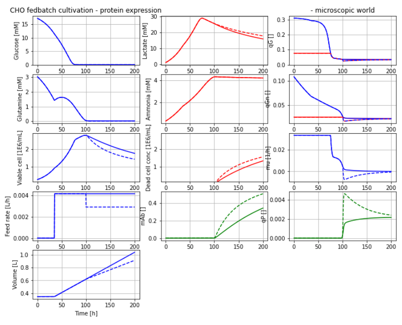

# BPL_CHO_Fedbatch

This example of cultivation of CHO culture using fedbatch technique is in laboratory scale. The model describes by-products (lactate and ammonia) formation at over-feeding based on a publication. The original model is extended to describe also recombinant protein production. Simulation is done using an FMU from Bioprocess Library *for* Modelica. Below a diagramwith a typical simulation that you will get at the end of the Jupyter notebook.

 
 [start BPL notebook](https://colab.research.google.com/github/janpeter19/BPL_CHO_Fedbatch/blob/main/BPL_CHO_Fedbatch_colab.ipynb)
 
Work in progress - stay tuned!

License information:
* The binary-file with extension FMU is shared under the permissive MIT-license
* The other files are shared under the GPL 3.0 license
